<!-- ========================================================================== -->
<!-- TEJAS GOSWAMI - WORLD-CLASS DEVOPS ENGINEER PROFILE README               -->
<!-- Designed with Dark Theme Glassmorphic Aesthetics, Custom Diagrams & Badges -->
<!-- ========================================================================== -->

<div align="center">

  <!-- 1. PREMIUM HERO BANNER -->
  

  <p align="center">
    <a href="https://tejasgsv.github.io/tejasgsv/">
      
    </a>
    <a href="https://www.linkedin.com/in/tejas-goswami-301606212/">
      
    </a>
    <a href="mailto:goswamitejas909@gmail.com">
      
    </a>
  </p>

  <!-- 2. ANIMATED TYPING HEADER -->
  <p align="center">
    
  </p>

</div>

---

<!-- GLASSMORPHIC STATS BADGE BAR -->
<div align="center">
  <table border="0" cellspacing="0" cellpadding="0">
    <tr>
      <td align="center" width="200">
        <h3>💼 2+ Years</h3>
        <p>Pro DevOps Experience</p>
      </td>
      <td align="center" width="220">
        <h3>🏢 Reliance Jio</h3>
        <p>Infocomm Ltd</p>
      </td>
      <td align="center" width="220">
        <h3>☁️ Azure Primary</h3>
        <p>Enterprise Infrastructure</p>
      </td>
      <td align="center" width="200">
        <h3>⚙️ IaC First</h3>
        <p>Terraform & Automation</p>
      </td>
    </tr>
  </table>
</div>

---

## 👨‍💻 3. About Me

```gdb
+-----------------------------------------------------------------------------------+
|  NAME        : Tejas Goswami                                                     |
|  ROLE        : DevOps Engineer                                                   |
|  COMPANY     : Reliance Jio Infocomm Ltd                                          |
|  LOCATION    : India                                                             |
|  EXPERIENCE  : ~2 Years of Hands-on Cloud & Automation Engineering                |
|  SPECIALTY   : Azure Infrastructure, Terraform IaC, DevSecOps, CI/CD, Observability|
+-----------------------------------------------------------------------------------+
```

Hello! I am **Tejas Goswami**, a results-driven **DevOps Engineer** with around 2 years of professional experience building, automating, securing, and supporting mission-critical cloud infrastructure at **Reliance Jio Infocomm Ltd**.

My primary focus lies in transforming manual operations into self-healing, automated, and secure Infrastructure as Code ecosystems powered by **Microsoft Azure**, **Terraform**, **Azure DevOps**, and **GitHub Actions**.

---

## 🎯 4. Professional Summary

- ☁️ **Azure Cloud Engineering**: Extensive experience provisioning scalable Azure Virtual Networks (VNets), Virtual Machines, Storage Accounts, Network Security Groups (NSGs), and Resource Groups using modular Terraform codebases.
- ⚙️ **Infrastructure as Code (IaC)**: Expert in writing reusable, enterprise-grade **Terraform** modules, managing state files, and automating infrastructure deployment via Azure CLI and CI/CD pipelines.
- 🚀 **Continuous Integration & Delivery**: Architect of zero-downtime CI/CD build and release workflows using **Azure DevOps Pipelines** and **GitHub Actions**.
- 🔒 **DevSecOps Integration**: Dedicated to embedding security early in the pipeline using automated static analysis tooling including **Checkov**, **tfsec**, and **TFLint**.
- 📊 **Enterprise Observability**: Hands-on expertise configuring telemetry, log aggregations, and alerting frameworks using **Azure Monitor**, **Log Analytics**, and the **ELK Stack (Elasticsearch, Logstash, Kibana)**.

---

## 📌 5. Current Focus

```
🟢 Azure Cloud Automation      ► [ ████████████████████ ] 95%
🟢 Infrastructure as Code      ► [ ████████████████████ ] 92%
🟢 DevSecOps & Security Scans  ► [ ██████████████████░░ ] 88%
🟢 Kubernetes & Containers     ► [ █████████████████░░░ ] 85%
🟡 OpenShift & GitOps (ArgoCD) ► [ ██████████████░░░░░░ ] 70%
```

---

## ⚡ 6. Core Competencies

<table>
  <tr>
    <td width="50%">
      <h3>☁️ Cloud & Infrastructure</h3>
      <ul>
        <li><strong>Cloud Infrastructure Automation</strong> on Microsoft Azure</li>
        <li><strong>Virtual Networking</strong> (VNets, Subnets, NSGs, Peering)</li>
        <li><strong>Compute & Storage</strong> (Azure VMs, Storage Accounts, Disks)</li>
        <li><strong>Linux Administration</strong> & Shell Customization</li>
      </ul>
    </td>
    <td width="50%">
      <h3>⚙️ Automation & Pipeline Engineering</h3>
      <ul>
        <li><strong>Infrastructure as Code (IaC)</strong> with Terraform</li>
        <li><strong>CI/CD Pipeline Implementation</strong> (Azure DevOps & GitHub Actions)</li>
        <li><strong>DevSecOps Integration</strong> (Checkov, tfsec, TFLint)</li>
        <li><strong>Release & Deployment Automation</strong> in Production</li>
      </ul>
    </td>
  </tr>
  <tr>
    <td width="50%">
      <h3>🐳 Containers & Orchestration</h3>
      <ul>
        <li><strong>Containerization</strong> using Docker & Dockerfiles</li>
        <li><strong>Container Security</strong> & Image Optimization</li>
        <li><strong>Kubernetes Workload Management</strong></li>
        <li><strong>Azure Kubernetes Service (AKS)</strong> (Learning & Adoption)</li>
      </ul>
    </td>
    <td width="50%">
      <h3>📊 Observability & Operations</h3>
      <ul>
        <li><strong>Infrastructure Monitoring</strong> via Azure Monitor</li>
        <li><strong>Log Aggregation</strong> using Log Analytics & ELK Stack</li>
        <li><strong>Production Operations & Support</strong> (Troubleshooting & Escalations)</li>
        <li><strong>Incident Resolution & Root Cause Analysis</strong></li>
      </ul>
    </td>
  </tr>
</table>

---

## 🔄 7. DevOps Lifecycle Integration

```mermaid
graph LR
    subgraph PLAN ["1. PLAN & CODE"]
        A[Git / GitHub] --> B[YAML Configs]
        B --> C[Bash / PowerShell Scripts]
    end

    subgraph SECURE ["2. DEVSECOPS SCAN"]
        C --> D[TFLint]
        D --> E[tfsec Security]
        E --> F[Checkov Compliance]
    end

    subgraph PROVISION ["3. IAC PROVISION"]
        F --> G[Terraform Init / Plan]
        G --> H[Azure CLI Validation]
        H --> I[Terraform Apply]
    end

    subgraph DEPLOY ["4. CI/CD DEPLOY"]
        I --> J[Azure DevOps Pipelines]
        J --> K[GitHub Actions Workflow]
        K --> L[Docker Container Deployment]
    end

    subgraph MONITOR ["5. OBSERVABILITY"]
        L --> M[Azure Monitor]
        M --> N[Log Analytics & ELK Stack]
    end

    style PLAN fill:#0b132b,stroke:#0ea5e9,stroke-width:2px,color:#fff
    style SECURE fill:#1c2541,stroke:#6366f1,stroke-width:2px,color:#fff
    style PROVISION fill:#0b132b,stroke:#06b6d4,stroke-width:2px,color:#fff
    style DEPLOY fill:#1c2541,stroke:#10b981,stroke-width:2px,color:#fff
    style MONITOR fill:#0b132b,stroke:#f59e0b,stroke-width:2px,color:#fff
```



---

## ☁️ 8. Azure Cloud Architecture Expertise

I design and manage resilient Microsoft Azure infrastructure architectures tailored for enterprise workloads:

```
+-------------------------------------------------------------------------------+
|                             MICROSOFT AZURE CLOUD                             |
|                                                                               |
|   +-----------------------------------------------------------------------+   |
|   |                       AZURE VIRTUAL NETWORK (VNet)                     |   |
|   |                                                                       |   |
|   |   +-----------------------+       +-------------------------------+   |   |
|   |   |    PUBLIC SUBNET      |       |        PRIVATE SUBNET         |   |   |
|   |   |                       |       |                               |   |   |
|   |   |  - NSG Firewalls      | <---> |  - Azure VMs (Linux/Compute)  |   |   |
|   |   |  - Gateway Devices    |       |  - Docker / AKS Pod Workloads |   |   |
|   |   +-----------------------+       +-------------------------------+   |   |
|   |                                                   |                   |   |
|   +---------------------------------------------------|-------------------+   |
|                                                       v                       |
|   +-----------------------+           +-------------------------------+       |
|   | Azure Storage Accounts|           | Azure Monitor & Log Analytics |       |
|   | (Blob / IaC State)    |           | (KQL Telemetry & Alerts)      |       |
|   +-----------------------+           +-------------------------------+       |
+-------------------------------------------------------------------------------+
```

---

## 🛠️ 9. CI/CD Workflow Architecture

Below is my standard automated release pipeline design for infrastructure and application code:

```
[ Developer Push ] ──► [ GitHub / Git ] ──► [ Trigger CI Pipeline ]
                                                   │
                                                   ▼
                                     ┌───────────────────────────┐
                                     │   DevSecOps Gate Scans    │
                                     │  • TFLint (Syntax)        │
                                     │  • tfsec (Security)       │
                                     │  • Checkov (Policies)     │
                                     └─────────────┬─────────────┘
                                                   │ (Pass)
                                                   ▼
                                     ┌───────────────────────────┐
                                     │    Terraform Execution    │
                                     │  • terraform plan         │
                                     │  • Azure Auth (Azure CLI) │
                                     │  • terraform apply        │
                                     └─────────────┬─────────────┘
                                                   │
                                                   ▼
                                     ┌───────────────────────────┐
                                     │  Production Deployment    │
                                     │  • Docker Image Container │
                                     │  • Azure Service Deploy   │
                                     └─────────────┬─────────────┘
                                                   │
                                                   ▼
                                     ┌───────────────────────────┐
                                     │   Telemetry Monitoring    │
                                     │  • Log Analytics Metrics  │
                                     │  • ELK Dashboard Alerts   │
                                     └───────────────────────────┘
```

---

## 💼 10. Professional Experience

### **DevOps Engineer** | *Reliance Jio Infocomm Ltd*
📅 **Duration**: ~2 Years  
📍 **Location**: India  
🏷️ **Domain**: Telecommunications & Enterprise Cloud Operations  

**Key Responsibilities & Achievements**:
- **Cloud Infrastructure Provisioning**: Designed, provisioned, and managed Azure virtual networks, compute instances, storage accounts, and network security groups utilizing modular **Terraform** configurations.
- **CI/CD Automation**: Engineered reusable YAML pipeline templates in **Azure DevOps** and **GitHub Actions**, cutting manual release overhead by over 60%.
- **DevSecOps Policy Enforcement**: Integrated automated policy validation checks using **Checkov** and **tfsec** into pull-request validation pipelines to block insecure cloud resource declarations prior to deployment.
- **Containerization & Orchestration**: Packaged backend services into lightweight **Docker** containers and supported containerized application deployments on Linux server environments.
- **Production Support & Incident Management**: Acted as core engineer for production troubleshooting, resolving live infrastructure incidents, investigating deployment bottlenecks, and maintaining high platform reliability.
- **Telemetry & Monitoring**: Configured **Azure Monitor** workspaces, KQL log queries, and **ELK Stack** dashboards to monitor infrastructure telemetry and notify NOC teams of anomaly alerts.

---

## 🚀 11. Featured Projects

### 1️⃣ Automated Infrastructure Deployment Pipeline
- **Tech Stack**: `Microsoft Azure` | `Terraform` | `GitHub Actions` | `Azure CLI` | `Bash`
- **Description**: Designed an automated Infrastructure as Code pipeline that provisions an end-to-end Microsoft Azure environment (VNets, Subnets, Storage Accounts, NSGs, Linux VMs).
- **Key Outcome**: Eliminated manual portal configurations, ensured version-controlled infrastructure state management, and enabled one-click reproducible deployments across environments.

---

### 2️⃣ DevSecOps CI/CD Policy Integration
- **Tech Stack**: `Azure DevOps` | `Checkov` | `tfsec` | `TFLint` | `YAML`
- **Description**: Built a security-first automated pull-request validation pipeline inside Azure DevOps Pipelines.
- **Key Outcome**: Automatically scans Terraform IaC code against security best practices, catches hardcoded secrets and unencrypted storage buckets, and enforces compliance policies before code merges into `main`.

---

### 3️⃣ Multi-Service Observability Stack
- **Tech Stack**: `ELK Stack (Elasticsearch, Logstash, Kibana)` | `Azure Monitor` | `Log Analytics`
- **Description**: Configured a centralized log aggregation and infrastructure telemetry monitoring stack for distributed application services.
- **Key Outcome**: Streamlined real-time log analysis, created interactive Kibana dashboards for Operations teams, and configured automated threshold alerting for high CPU/Memory/Disk usage.

---

## 💻 12. Technical Skills Matrix

<div align="center">

### ☁️ Cloud Platform
<p>
  
  
</p>

### ⚙️ Infrastructure as Code & Scripting
<p>
  
  
  
  
  
</p>

### 🚀 CI/CD & Version Control
<p>
  
  
  
  
</p>

</div>

---

## 🔒 13. DevSecOps Tools

<p align="center">
  
  
  
  
</p>

---

## ☁️ 14. Cloud Stack

```
           +-------------------------------------------------------+
           |               MICROSOFT AZURE ECOSYSTEM               |
           +-------------------------------------------------------+
           |  • Azure Resource Groups & Subscriptions              |
           |  • Virtual Networks (VNets), Subnets, Peering & NSGs   |
           |  • Virtual Machines (Linux Ubuntu / RHEL)             |
           |  • Azure Blob Storage Accounts & State Locking         |
           |  • Azure Monitor & Log Analytics Workspaces            |
           |  • Azure CLI & Azure Resource Manager Templates        |
           +-------------------------------------------------------+
```

---

## 🐳 15. Containers & Orchestration

<p align="center">
  
  
  
</p>

---

## 📊 16. Monitoring & Logging

<p align="center">
  
  
  
  
</p>

---

## ⚙️ 17. Infrastructure as Code (IaC)

```hcl
# Example Infrastructure Declaration Pattern (Terraform + Azure)
terraform {
  required_version = ">= 1.5.0"
  required_providers {
    azurerm = {
      source  = "hashicorp/azurerm"
      version = "~> 3.80.0"
    }
  }
  backend "azurerm" {
    resource_group_name  = "rg-tfstate-prod"
    storage_account_name = "sttfstateprod"
    container_name       = "tfstate"
    key                  = "infrastructure.tfstate"
  }
}

provider "azurerm" {
  features {}
}
```

---

## 📈 18. GitHub Statistics

<div align="center">
  
  
</div>

---

## 🔥 19. GitHub Streak Stats

<div align="center">
  
</div>

---

## 📊 20. GitHub Activity Graph

<div align="center">
  
</div>

---

## 🏆 21. GitHub Trophies

<div align="center">
  
</div>

---

## 📜 22. Certifications

- 📜 **Microsoft Azure Fundamentals (AZ-900)** — Azure Cloud Foundations
- 🏗️ **HashiCorp Certified: Terraform Associate** *(In Progress / Advanced Study)*
- ☸️ **Certified Kubernetes Administrator (CKA)** *(Roadmap Preparation)*

---

## 🌱 23. Current Learning Roadmap

<div align="center">
  <table border="0">
    <tr>
      <td align="center" width="20%">
        <h4>🔴 OpenShift</h4>
        <p>Enterprise K8s</p>
      </td>
      <td align="center" width="20%">
        <h4>⎈ Helm</h4>
        <p>K8s Package Mgr</p>
      </td>
      <td align="center" width="20%">
        <h4>🔄 GitOps</h4>
        <p>ArgoCD Flow</p>
      </td>
      <td align="center" width="20%">
        <h4>🐙 ArgoCD</h4>
        <p>Declarative Continuous Delivery</p>
      </td>
      <td align="center" width="20%">
        <h4>☁️ AKS</h4>
        <p>Azure Managed Kubernetes</p>
      </td>
    </tr>
  </table>
</div>

---

## 📫 24. Connect With Me

<div align="center">

  <p>Feel free to reach out for DevOps collaboration, Azure Cloud architecture discussions, or professional networking!</p>

  <a href="mailto:goswamitejas909@gmail.com">
    
  </a>
  <a href="https://www.linkedin.com/in/tejas-goswami-301606212/">
    
  </a>
  <a href="https://github.com/tejasgsv">
    
  </a>
  <a href="https://tejasgsv.github.io/tejasgsv/">
    
  </a>

</div>

---

## 💬 25. Quote & Profile Telemetry

<div align="center">

  <br/>
  <h3>⭐ <em>"Automating today for a more reliable tomorrow."</em></h3>
  <br/>

  

  <p>© 2026 Tejas Goswami — DevOps Engineer @ Reliance Jio Infocomm Ltd</p>

</div>
